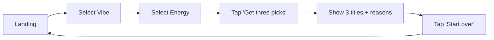

# PRD: Mood Movie Picker

**Source:** [Notion — PRD: Mood Movie Picker](https://www.notion.so/35dda74ef04580ca8512ea56ee66ffa5)

> **Status:** Draft · **Owner:** TBD · **Version:** 1.0 · **Last updated:** 2026-05-11  
> **Target ship:** v0 in a single ~20-minute build session

## 1. Overview

Mood Movie Picker is a **single-page web app** that recommends **three movies** based on a user's current **mood (vibe)** and **energy level**. The user makes two selections, taps one button, and sees three titles with a one-line reason for each match. The product is intentionally minimal: no accounts, no database, no third-party APIs — just a curated, hardcoded catalog and deterministic matching logic.

## 2. Background & Problem Statement

Most movie-discovery tools optimize for breadth (large catalogs, filtering, ratings) and overwhelm a user who simply wants something to watch *right now*. Even "what should I watch tonight" workflows usually require sign-ins, watchlists, or scrolling through dozens of rows. There is room for a near-zero-friction picker that converts a feeling into a concrete short-list in two taps.

## 3. Goals

- **G1.** A user can go from landing page → three personalized picks in **≤ 2 interactions**.
- **G2.** Always return **exactly 3** titles — no empty states.
- **G3.** Ship a fully working v0 in a single short build session, with **zero external dependencies**.
- **G4.** Code remains small enough to be read end-to-end in under 5 minutes.

## 4. Non-Goals (v0)

- No user accounts, authentication, or persistence of taste.
- No database — catalog lives in code.
- No third-party APIs (TMDb, OMDb, JustWatch, etc.).
- No posters, trailers, streaming-availability, or deep-links.
- No ML, personalization, or complex scoring — a lookup table is sufficient.
- No analytics, telemetry, or A/B framework.

## 5. Target Users & Personas

| Persona | Context | Primary need |
| --- | --- | --- |
| **The Decider** | Has 5 minutes before pressing play, doesn't want to scroll. | A short, opinionated shortlist that matches their mood. |
| **The Indecisive Pair** | Two people negotiating what to watch. | Three reasonable options to pick from quickly. |
| **The Curious Demoer** | Sharing the prototype with a friend. | Something that loads instantly and "just works" with no setup. |

## 6. User Stories

- **US-1.** As a user, I can pick a **vibe** from a small set of options (Cozy, Sad, Fun, Tense, Romantic) so the app understands my mood.
- **US-2.** As a user, I can pick an **energy level** (Chill, Medium, Hype) so the app understands my pacing preference.
- **US-3.** As a user, I can tap **Get three picks** and immediately see exactly three movie titles, each with a one-line reason.
- **US-4.** As a user, I can tap **Start over** to reset my selections and try a different combination.
- **US-5.** As a user on either desktop or mobile, the layout is readable and tap targets are comfortable.

## 7. User Flow



## 8. Functional Requirements

### 8.1 Inputs

- **FR-1.** Vibe selector — single choice from: `Cozy`, `Sad`, `Fun`, `Tense`, `Romantic`.
- **FR-2.** Energy selector — single choice from: `Chill`, `Medium`, `Hype`.
- **FR-3.** Both inputs are required before the CTA can be activated.

### 8.2 Matching

- **FR-4.** The app filters a hardcoded catalog of **12–20 movies** using the matching rule below.
- **FR-5.** **Matching rule (v0):**
  1. Take all movies whose `vibes` array contains the selected vibe **and** whose `energy` equals the selected energy.
  2. If fewer than 3 matches, fill the remaining slots with movies that match the **vibe only**.
  3. If still fewer than 3, fill from the full catalog so the result is **always 3**.
- **FR-6.** Result order is deterministic for a given (vibe, energy) pair in v0 (no shuffle).

### 8.3 Output

- **FR-7.** Show exactly 3 titles, each as `Title — short reason`.
- **FR-8.** The reason is **templated**, e.g. *"Cozy + Chill → comfort food on a screen."*
- **FR-9.** A **Start over** button resets selections and returns to Screen A.

### 8.4 Copy

- **Headline:** Pick a mood. Get three movies.
- **Sub:** Two taps, no scrolling.
- **CTA:** Get three picks

## 9. Data Model

A single in-memory array; each movie is:

```typescript
type Movie = {
	title: string;
	vibes: Array<"Cozy" | "Sad" | "Fun" | "Tense" | "Romantic">;
	energy: "Chill" | "Medium" | "Hype";
};
```

The catalog is **stubbed in code** — no network calls, no JSON file, no API. It can later be promoted to `movies.json` without changing the matching logic.

## 10. Non-Functional Requirements

- **NFR-1. Performance:** First paint < 100 ms on a modern laptop; interaction response < 16 ms.
- **NFR-2. Footprint:** Single `index.html` file; no build step; no `node_modules`.
- **NFR-3. Dependencies:** **Zero** runtime dependencies. No external API calls of any kind.
- **NFR-4. Accessibility:** Keyboard-navigable controls, semantic HTML, sufficient color contrast.
- **NFR-5. Responsiveness:** Works on viewports ≥ 320 px wide.
- **NFR-6. Privacy:** No data leaves the user's browser. No analytics.

## 11. Success Metrics

- **M1.** A first-time user completes the flow without instructions.
- **M2.** Time-to-first-recommendation < **10 seconds** from page load.
- **M3.** The demo can be opened locally in a browser in **< 1 minute**.
- **M4.** Total source size for the v0 page < **300 lines**.

## 12. Out of Scope (this release)

- Account system / saved preferences
- Server, database, or backend of any kind
- Posters, trailers, descriptions beyond the one-line reason
- "Where to watch" / streaming integrations
- Internationalization

## 13. Future Roadmap (post-v0)

1. Add a **third question** (e.g. *solo vs. with someone*) and one matching field per movie.
2. Grow catalog to **~50** titles and move data to `movies.json`.
3. Add a **Shuffle** so repeated runs surface new picks.
4. Integrate **TMDb** for posters and metadata (first external API).
5. Replace templated reasons with **richer per-combo blurbs**.
6. Add **"where to watch"** via a streaming-availability provider.

## 14. Open Questions

- [ ] Final list of vibes — keep at 5 or trim to 3 for v0?
- [ ] Should the CTA be disabled until both inputs are chosen, or auto-default the energy to *Medium*?
- [ ] Should the picks page link back to the catalog or only offer *Start over*?

## 15. Appendix — Implementation Notes

- **Stack:** Single `index.html` with inline CSS and a `<script>` block. No framework.
- **Catalog:** Stubbed in JavaScript array; treat as the equivalent of a placeholder for a future API.
- **Distribution:** Public GitHub repository; can be opened directly from disk or served by any static host.

---

> **Rule of thumb for the v0 cut:** if a feature requires a new system (API keys, routing, state persistence, build tooling), it waits for v2. A curated list + two inputs + three outputs is the whole product.
